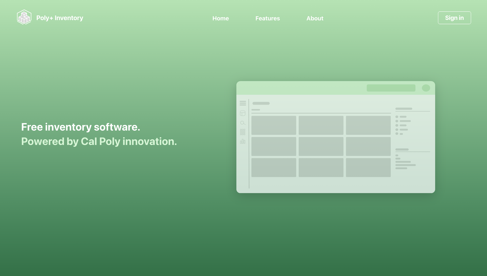
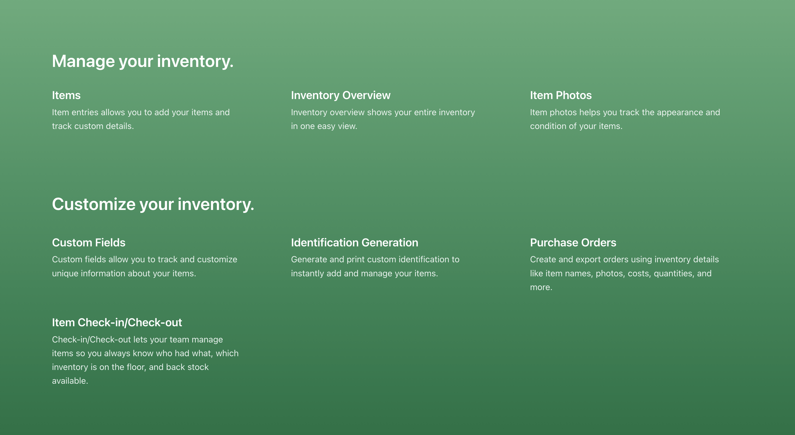
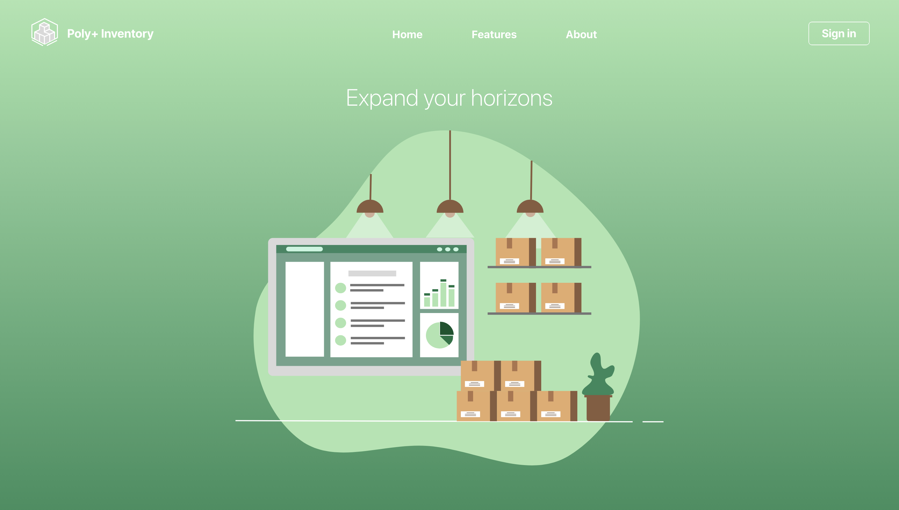
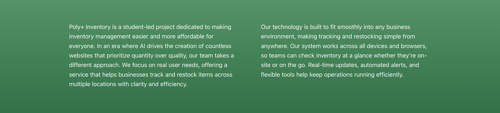

<p align="center"> 
  
</p>

# Table of contents

- [About](#about)
- [Features](#features)
- [Tech Stack](#tech-stack)
- [Screenshots](#screenshots)
- [Demo / Live URL](#demo)
- [Getting Started](#getting-started)
  - [Installation](#installation)
  - [Running the Website](#running-the-website)
- [Contributors](#contributors)

## About

Welcome to our humble GitHub page! Poly+ inventory is an inventory management website created by a small group of Cal Poly engineers. Tasked with creating a website for an introductory software development class, our group decided to make a product focused on simplicity and affordability. From there, the idea of an inventory management website was born. Over the course of five weeks, our team was able to produce a fully functional website ready for small and large businesses alike to use...all at the cost of FREE! The entire team hopes that users love our product. Enjoy! 

## Features 

Our product includes the following features: 

- Custom login credentials with email verification
- Tracking of quantity on display as well as back stock
- Add/removal of products
- Searching by name or identification number
- Filtering using price and quantity 
- Editing of product information including name, identification number, quantity, and price 

## Tech Stack

The following tools were used: 

### Frontend

- Azure Static Web Apps
- Github Actions CI/CD
- ESLint + Prettier
- Firebase
- React
- Vite

### Backend

- Express.js / Node
- MongoDB Atlas

## Screenshots

### Home 


### Features




### About



## Demo / Live URL 

Please click here to access our website: https://victorious-ocean-026f9ee1e.3.azurestaticapps.net

## Getting Started

### Installation 

Follow the steps bellow to set up the project locally: 

1. Clone the repository
```bash
git clone https://github.com/Poly-InventoryCSC307/CSC307GroupProject.git

cd CSC307GroupProject

2. Install dependencies 
```bash
cd packages/react-frontend
npm install

cd ../backend
npm install

3. Configure environment variables
Create a .env file inside the backend folder with your personal settings. 
```bash
PORT=3000
MONGO_URI=your-database-url


